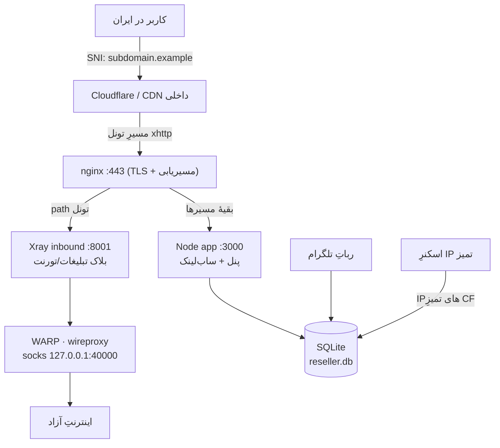
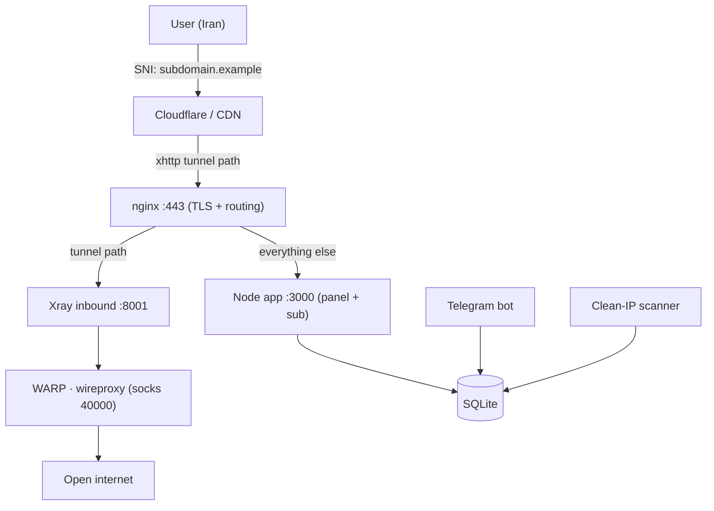

<div align="center">

# ⚔️ AmirPanel — امیرپنل

### The complete one-command anti-censorship VPN reseller stack
### سیستمِ کاملِ فروشِ VPN ضدفیلتر، با یک دستور نصب

**x-ui · Xray (XHTTP/Reality) · WARP · nginx · Clean-IP scanner · Reseller panel + Telegram bot**

<br>


[](https://t.me/v28pn)

### 🔴 [دموی زندهٔ برندینگ → Live branding demo](https://amirgraph.github.io/xui-reseller/demo/)

</div>

---

<div dir="rtl">

## 🇮🇷 فارسی

### امیرپنل چیست؟

**امیرپنل** یک اکوسیستمِ آمادهٔ فروشِ VPN است که برای شرایطِ سختِ فیلترینگ ساخته شده. به‌جای اینکه ساعت‌ها x-ui و WARP و nginx و ربات را دستی سرِهم کنی، **یک دستور می‌زنی، چند سؤال جواب می‌دهی، و کلِ کسب‌وکارت بالا می‌آید** — پنلِ نماینده، رباتِ تلگرام، قیمت‌گذاری، پرداختِ کریپتو، و ضدفیلترِ چندلایه.

> ساخته‌شده روی درس‌های واقعیِ میدان: پایداری زیرِ بار، دورزدنِ فیلترینگِ دامنه و IP، و تجربهٔ روانِ مشتری.

<div align="center">

<br><em>داشبوردِ پنلِ نماینده — مدرن، RTL، گلَس‌مورفیسم</em>
</div>

### ✨ ویژگی‌ها

| | |
|---|---|
| 🛡️ **ضدفیلترِ چندلایه** | تونلِ **xhttp** پشتِ **Cloudflare** با ساب‌دامینِ تصادفی · خروجی از **WARP** (IP مبدأ مخفی) · **اسکنرِ IP تمیز** که خودکار بهترین IP کلادفلر را پیدا و جایگزین می‌کند |
| 🌍 **چندکشوره (Multi-server)** | چند سرورِ 3x-ui را به یک پنل وصل کن؛ **هر تعداد دامنه که بخواهی → همان‌تعداد کانفیگ و همان‌تعداد IP اسکن** می‌شود |
| 💼 **آمادهٔ کسب‌وکار** | پنلِ نماینده با برندینگِ اختصاصی · رباتِ تلگرام برای فروش/شارژ · قیمت‌گذاریِ کامل (هر گیگ، نامحدود، پنلِ آماده) · کارت‌به‌کارت و **کریپتو (Plisio)** |
| 💾 **بکاپِ خودکار** | هر شب به کانالِ تلگرام + بکاپِ لحظه‌ای و بازیابی از پنلِ ادمین (WAL-safe، بدونِ خرابیِ دیتابیس) |
| 🎙️ **ویس‌چتِ زنده** | LiveKit روی صفحهٔ ساب (اختیاری) |
| 🔒 **امن از پایه** | **هیچ رمز/کلیدی در ریپو نیست** — همه هنگام نصب پرسیده یا خودکار ساخته می‌شود |

### 🚀 نصب — یک دستور

```bash
git clone https://github.com/amirgraph/xui-reseller.git amirpanel
cd amirpanel
sudo bash setup.sh
```

نصب‌کننده این‌ها را می‌پرسد و بقیه را خودش انجام می‌دهد:

```
۱/۶  دامنه‌ها ............ دامنهٔ اصلی + دامنهٔ Cloudflare
۲/۶  تلگرام و ادمین ...... توکن ربات، آیدی ادمین، رمز پنل
۳/۶  x-ui ................ یوزر/رمز (مسیر و کلید API خودکار)
۴/۶  قیمت‌گذاری .......... قیمت پنل، هر گیگ، نامحدود، شارژ
۵/۶  سرور ................ IP (خودکار تشخیص)
۶/۶  کلیدهای امنیتی ...... JWT و … خودکار ساخته می‌شوند
```

**پیش‌نیاز:** یک سرورِ **تازهٔ** اوبونتو ۲۲/۲۴، یک دامنهٔ اصلی، و یک دامنه روی Cloudflare.

### 🧭 معماری



**چرا این‌طوری؟** SNI (ساب‌دامین) از داخلِ ایران دیده نمی‌شود چون پشتِ Cloudflare است؛ IP مقصد یک IP تمیزِ کلادفلر است (نه IP سرور)؛ و خروجیِ نهایی از WARP می‌رود تا IP واقعیِ سرور جایی لو نرود. سه لایه، سه نقطهٔ شکستِ مستقل.

### 🌍 چندسروری و افزودنِ دامنه

از پنلِ ادمین → **سرورها**:

- **کشورِ جدید:** یک سرورِ 3x-ui دیگر اضافه کن (آدرس پنل + کلید API + دامنه‌ها + شناسهٔ اینباند). ساب‌لینک خودکار از همهٔ سرورهای فعال ساخته می‌شود.
- **افزودنِ دامنه:** فیلدِ `domains` هر سرور کاما-جداست و **هر تعداد** دامنه می‌پذیرد. به ازای هر دامنه یک کانفیگ ساخته می‌شود و اسکنر هم **به همان تعداد** IP تمیز نگه می‌دارد.
- **بدونِ دستکاریِ nginx:** بلاکِ ۴۴۳ روی `default_server` است، پس هر ساب‌دامینِ جدیدی که DNSش را به IP سرور point کنی، خودکار کار می‌کند.

### ⚙️ بعد از نصب

1. **Cloudflare** — ساب‌دامین‌های امیرپنل (که نصب‌کننده نشان می‌دهد) را با پروکسیِ نارنجی به IP سرور بزن.
2. **CDN داخلی (آروان/…)** — دامنهٔ اصلی را به سرور وصل کن و کش را برای `/sub` روشن کن (تا از داخلِ ایران بدونِ فیلترشکن باز شود).
3. **ربات** — توکن را از [@BotFather](https://t.me/BotFather) بگیر و هنگامِ نصب وارد کن.

### ❓ رفعِ ابهام (FAQ)

<details>
<summary><b>از قبل x-ui با کاربر دارم؛ این را نصب کنم چه می‌شود؟</b></summary>

<br>نصب‌کننده برای **سرورِ تازه** طراحی شده. اگر روی سروری با x-uiِ موجود اجرا کنی:
- ✅ **اینباند و کاربرانِ موجود حفظ می‌شوند** (پکیج هیچ دیتابیسی همراه ندارد و قبل از هر تغییر یک **بکاپِ خودکار** از `x-ui.db` گرفته می‌شود).
- ⚠️ ولی **پورت/مسیر/رمزِ پنل و قالبِ routing بازنویسی می‌شود** (کلِ خروجی به WARP می‌رود) و پورت ۴۴۳ توسطِ nginx گرفته می‌شود.

👉 توصیه: روی **سرورِ تمیز** نصب کن. اگر مجبوری روی سرورِ موجود بزنی، بعد از نصب کانفیگِ اینباندهای قدیمی‌ات را چک کن.
</details>

<details>
<summary><b>کانفیگ‌ها پینگ نمی‌دهند / وصل نمی‌شوند</b></summary>

<br>چک کن: (۱) DNS ساب‌دامین‌ها به IP سرور point شده و **پروکسیِ Cloudflare نارنجی** است؛ (۲) مسیرِ تونل در کانفیگ با مسیرِ nginx/xray یکی است (نصب‌کنندهٔ جدید این را خودکار هماهنگ می‌کند)؛ (۳) IPهای تمیز پر شده‌اند (اسکنر اجرا شده). یک GETِ خالی روی مسیرِ تونل **۴۰۴** می‌دهد و این **طبیعی** است (xhttp این‌طور جواب می‌دهد).
</details>

<details>
<summary><b>وسطِ چتِ AI یا استریم قطع می‌شود / ناوسان دارد</b></summary>

<br>تقریباً همیشه به‌خاطرِ **auto-switch/url-test در کلاینت** است: وقتی چند کانفیگ داری و اپ روی حالتِ خودکار است، هر چند ثانیه کانفیگ را عوض می‌کند و اتصالِ استریمِ طولانی (چتِ AI) قطع می‌شود. **یک کانفیگِ ثابت را انتخاب/Pin کن** — بقیه فقط برای backup باشند.
</details>

### 🩺 عیب‌یابیِ سریع

```bash
sudo bash scripts/99-verify.sh   # تستِ تونل، WARP، nginx، پنل، ربات
journalctl -u x-ui -n 50         # لاگِ x-ui
pm2 logs xui-reseller            # لاگِ پنل
```

</div>

---

## 🇬🇧 English

**AmirPanel** is a batteries-included VPN reseller stack built for hostile networks. Instead of wiring up x-ui, WARP, nginx and a Telegram bot by hand, you run **one command, answer a few questions, and your whole business is live** — reseller panel, Telegram bot, pricing, crypto payments, and multi-layer anti-censorship.

### Features

- 🛡️ **Multi-layer evasion** — `xhttp` tunnel behind **Cloudflare** with random subdomains, **WARP** egress (hides origin IP), and an **auto clean-IP scanner** that keeps the best Cloudflare IPs rotating in.
- 🌍 **Multi-server** — attach several 3x-ui panels to one dashboard. **Add any number of domains → that many configs and that many scanned IPs**, automatically.
- 💼 **Business-ready** — branded reseller panel, Telegram bot for sales/top-ups, full pricing (per-GB, unlimited, ready panels), card + **crypto (Plisio)** payments.
- 💾 **Automatic backups** — nightly to a Telegram channel, plus on-demand backup/restore from the admin panel (WAL-safe, no DB corruption).
- 🎙️ **Live voice chat** — optional LiveKit room on the subscription page.
- 🔒 **Secure by design** — **no secrets in the repo**; everything is prompted or auto-generated at install time.

### Install

```bash
git clone https://github.com/amirgraph/xui-reseller.git amirpanel
cd amirpanel
sudo bash setup.sh
```

Requires a **fresh** Ubuntu 22/24 server, one main domain, and one Cloudflare domain.

### Architecture



The SNI is invisible from inside Iran (it sits behind Cloudflare), the destination is a clean Cloudflare IP (not the server's), and egress goes through WARP so the origin IP never leaks — three independent layers.

### Multi-server & adding domains

In the admin panel → **Servers**: add another 3x-ui server for a new country, or extend a server's comma-separated `domains` field with **any number** of subdomains. Configs and scanned IPs scale to match. nginx listens as `default_server`, so any new subdomain just works once its DNS points at the server.

### Tech stack

`Bash` · `Node.js 20` · `Express` · `SQLite` · `nginx` · `Xray-core (XHTTP/Reality)` · `Cloudflare WARP (wireproxy)` · `Telegram Bot API` · `PM2`

---

<div align="center">

## 🤝 بیا با هم بسازیمش — Join us

این پروژه open-source است و قرار است **معروف** شود. بیا کنارِ هم باگ بزنیم، ایده بدهیم، و تبلیغش کنیم.
کانال و پشتیبانی و گفت‌وگو:

### [💬 @v28pn — Telegram](https://t.me/v28pn)

<br>

## ☕ دونیت — Donate

اگر امیرپنل برایت کار راه انداخت، یه قهوه مهمونمون کن 😄 — کریپتو، از هر جای دنیا:

[](https://plisio.net/donate?api_key=Qqk6spjr1tNMxDMPiG6o4CWA9FJliUw8w2aeno4vF9RAycFSqedpCFOlBMIcKchG)

<br>

**License:** MIT — آزاد برای استفاده و تغییر. اگر به کارت آمد، یک ⭐ لطف کن.

<sub>Made for a free internet · ساخته‌شده برای اینترنتِ آزاد</sub>

</div>
